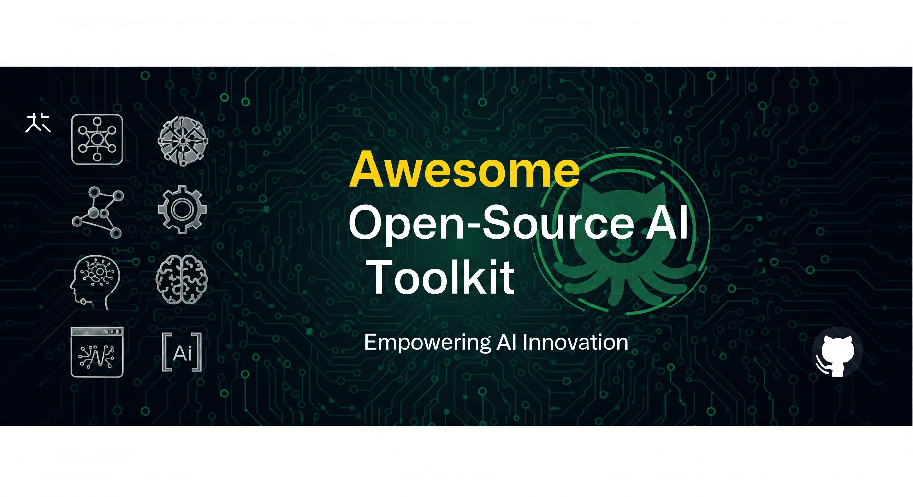

# Awesome Open-Source AI Toolkit

## Stop searching. This is the only AI toolkit a developer will ever need!

This toolkit covers all areas of AI, from machine learning basics to specialized fields like computer vision, NLP, reinforcement learning, and MLOps. Updated with 2025 trends for building, learning, and experimenting efficiently.

A curated, comprehensive collection of open-source AI tools, frameworks, datasets, courses, and seminal papers. Organized by AI domains and segregated for beginners (foundational, easy-to-use tools/courses) and advanced users (complex, production-ready resources). 

Whether you're a beginner starting your AI journey or an advanced engineer deploying scalable systems, this repo provides essential resources to accelerate your work. Contribute to keep it growing.

## Table of Contents

- [Why This Toolkit?](#why-this-toolkit)
- [🆕 2025 Trending Tools](#-2025-trending-tools)
- [AI Domains and Tools](#ai-domains-and-tools)
  - [Machine Learning Frameworks](#machine-learning-frameworks)
  - [Data Processing & Management](#data-processing--management)
  - [Vector Databases](#vector-databases)
  - [Orchestration & Workflow Frameworks](#orchestration--workflow-frameworks)
  - [Computer Vision](#computer-vision)
  - [Natural Language Processing (NLP)](#natural-language-processing-nlp)
  - [Reinforcement Learning (RL)](#reinforcement-learning-rl)
  - [MLOps](#mlops)
  - [PDF Extraction Tools](#pdf-extraction-tools)
  - [Retrieval-Augmented Generation (RAG)](#retrieval-augmented-generation-rag)
  - [Evaluation & Testing](#evaluation--testing)
  - [Monitoring & Observability](#monitoring--observability)
  - [AI Agents](#ai-agents)
  - [Generative AI](#generative-ai)
  - [Deep Learning](#deep-learning)
  - [Advanced LLM Architectures](#advanced-llm-architectures)
  - [🆕 AI Development Assistants](#-ai-development-assistants)
  - [🆕 Multimodal AI](#-multimodal-ai)
  - [🆕 Edge AI & Mobile](#-edge-ai--mobile)
  - [🆕 Audio & Speech Processing](#-audio--speech-processing)
  - [🆕 Deployment & Containerization](#-deployment--containerization)
  - [🆕 DevOps & Infrastructure](#-devops--infrastructure)
- [Datasets](#datasets)
- [Courses](#courses)
- [Papers](#papers)
- [How to Contribute](#how-to-contribute)
- [License](#license)

## Why This Toolkit?
- **Broad Coverage**: Spans all AI domains with detailed category separation.
- **Open-Source Only**: Exclusively free, community-driven tools and resources.
- **Skill-Level Segregation**: Beginner-friendly entries for quick starts; advanced for deep dives.
- **Beyond Tools**: Includes top datasets for exploration, free courses, and key papers.
- **Up-to-Date**: Trending resources as of August 2025, with GitHub stars for popularity insights.
- **Community-Driven**: Add new entries via PRs to make it more comprehensive and viral!

## 🆕 2025 Trending Tools

The latest trending open-source AI tools that are shaping 2025, focusing on smaller, smarter models and improved collaboration:

### 🔥 Hot New Releases
| Tool          | Description                                                                 | URL                                               | Stars | Trend |
|---------------|-----------------------------------------------------------------------------|---------------------------------------------------|-------|-------|
| Claude Code   | Command-line AI coding assistant from Anthropic                            | https://docs.anthropic.com/en/docs/claude-code   | New   | 🚀    |
| Aider         | AI pair programming in your terminal                                       | https://github.com/paul-gauthier/aider           | 15k   | 📈    |
| Cursor        | AI-powered code editor with advanced completion                            | https://cursor.sh/                               | -     | 🔥    |
| Windsurf      | Next-gen AI development environment                                        | https://github.com/codeium/windsurf              | 8k    | 📈    |
| Zed           | High-performance multiplayer code editor with AI                           | https://github.com/zed-industries/zed            | 45k   | 🚀    |

### 🎯 Most Starred in 2025
| Tool          | Description                                                                 | URL                                               | Stars |
|---------------|-----------------------------------------------------------------------------|---------------------------------------------------|-------|
| LLaMA 4       | Latest open-source large language model from Meta                          | https://github.com/facebookresearch/llama        | 180k  |
| Gemma 3       | Google's advanced lightweight language model                               | https://github.com/google/gemma                  | 25k   |
| Mixtral-8x22B | Sparse mixture of experts model                                            | https://github.com/mistralai/mistral-src         | 40k   |

## AI Domains and Tools

Tools are categorized by domain. Each includes a brief description, GitHub URL, and approximate stars (as of August 2025). Segregated into Beginner (simple setup, tutorials-focused) and Advanced (scalable, customizable) sub-sections.

### Machine Learning Frameworks
Foundational libraries for building and training ML models.

#### Beginner
| Tool          | Description                                                                 | URL                                               | Stars |
|---------------|-----------------------------------------------------------------------------|---------------------------------------------------|-------|
| scikit-learn | Simple machine learning in Python for classification, regression, and clustering | https://github.com/scikit-learn/scikit-learn     | 60k   |
| Keras        | User-friendly neural networks API on top of TensorFlow or PyTorch          | https://github.com/keras-team/keras              | 61k   |

#### Advanced
| Tool          | Description                                                                 | URL                                               | Stars |
|---------------|-----------------------------------------------------------------------------|---------------------------------------------------|-------|
| TensorFlow   | End-to-end platform for large-scale ML with strong ecosystem support       | https://github.com/tensorflow/tensorflow         | 183k  |
| PyTorch      | Dynamic neural networks with GPU acceleration for research and production  | https://github.com/pytorch/pytorch               | 81k   |

### Data Processing & Management
Tools for handling and preparing data.

#### Beginner
| Tool          | Description                                                                 | URL                                               | Stars |
|---------------|-----------------------------------------------------------------------------|---------------------------------------------------|-------|
| Pandas       | Easy data manipulation and analysis with DataFrames                        | https://github.com/pandas-dev/pandas             | 43k   |
| NumPy        | Fundamental array computing and linear algebra operations                  | https://github.com/numpy/numpy                   | 28k   |

#### Advanced
| Tool          | Description                                                                 | URL                                               | Stars |
|---------------|-----------------------------------------------------------------------------|---------------------------------------------------|-------|
| Dask         | Parallel computing for large datasets, integrates with Pandas/NumPy        | https://github.com/dask/dask                     | 12k   |

### Vector Databases
Open-source storage for embeddings and similarity search.

#### Beginner
| Tool          | Description                                                                 | URL                                               | Stars |
|---------------|-----------------------------------------------------------------------------|---------------------------------------------------|-------|
| Chroma       | Simple embedding database for local LLM apps                               | https://github.com/chroma-core/chroma            | 15k   |
| FAISS        | Efficient similarity search library from Facebook AI                       | https://github.com/facebookresearch/faiss        | 35k   |

#### Advanced
| Tool          | Description                                                                 | URL                                               | Stars |
|---------------|-----------------------------------------------------------------------------|---------------------------------------------------|-------|
| Weaviate     | Vector database with GraphQL and modular plugins                           | https://github.com/weaviate/weaviate             | 15k   |
| Qdrant       | High-performance vector search with filtering support                      | https://github.com/qdrant/qdrant                 | 20k   |
| Milvus       | Scalable vector database for billion-scale similarity search                | https://github.com/milvus-io/milvus              | 30k   |

### Orchestration & Workflow Frameworks
For building AI pipelines and agents.

#### Beginner
| Tool          | Description                                                                 | URL                                               | Stars |
|---------------|-----------------------------------------------------------------------------|---------------------------------------------------|-------|
| Langflow     | No-code visual builder for LLM workflows                                   | https://github.com/langflow-ai/langflow          | 15k   |
| Flowise      | Drag-and-drop UI for LLM chains                                            | https://github.com/FlowiseAI/Flowise             | 25k   |

#### Advanced
| Tool          | Description                                                                 | URL                                               | Stars |
|---------------|-----------------------------------------------------------------------------|---------------------------------------------------|-------|
| LangChain    | Modular framework for LLM apps and agents                                  | https://github.com/langchain-ai/langchain        | 120k  |
| LlamaIndex   | Data ingestion and querying for LLMs                                       | https://github.com/run-llama/llama_index         | 50k   |
| Haystack     | Production-ready NLP pipelines                                             | https://github.com/deepset-ai/haystack           | 18k   |
| DSPy         | Programmatic prompt optimization                                           | https://github.com/stanfordnlp/dspy              | 15k   |
| Semantic Kernel | AI integration SDK for .NET/Python/Java                                 | https://github.com/microsoft/semantic-kernel     | 8k    |

### Computer Vision
Libraries for image processing and vision tasks.

#### Beginner
| Tool          | Description                                                                 | URL                                               | Stars |
|---------------|-----------------------------------------------------------------------------|---------------------------------------------------|-------|
| OpenCV       | Core library for image/video processing and basic CV tasks                 | https://github.com/opencv/opencv                 | 75k   |

#### Advanced
| Tool          | Description                                                                 | URL                                               | Stars |
|---------------|-----------------------------------------------------------------------------|---------------------------------------------------|-------|
| Ultralytics YOLO | State-of-the-art object detection and segmentation models                  | https://github.com/ultralytics/ultralytics       | 30k   |
| Detectron2   | Facebook AI's framework for object detection and segmentation              | https://github.com/facebookresearch/detectron2   | 30k   |

### Natural Language Processing (NLP)
Tools for text analysis and language models.

#### Beginner
| Tool          | Description                                                                 | URL                                               | Stars |
|---------------|-----------------------------------------------------------------------------|---------------------------------------------------|-------|
| NLTK         | Toolkit for basic NLP tasks like tokenization and stemming                 | https://github.com/nltk/nltk                     | 13k   |
| spaCy        | Efficient NLP library for entity recognition and dependency parsing        | https://github.com/explosion/spaCy               | 29k   |

#### Advanced
| Tool          | Description                                                                 | URL                                               | Stars |
|---------------|-----------------------------------------------------------------------------|---------------------------------------------------|-------|
| Transformers | Hugging Face library for state-of-the-art NLP models                       | https://github.com/huggingface/transformers      | 130k  |
| Flair        | Framework for advanced NLP with pre-trained embeddings                     | https://github.com/flairNLP/flair                | 14k   |

### Reinforcement Learning (RL)
Frameworks for agent training and decision-making.

#### Beginner
| Tool          | Description                                                                 | URL                                               | Stars |
|---------------|-----------------------------------------------------------------------------|---------------------------------------------------|-------|
| Stable-Baselines3 | Reliable RL algorithms built on PyTorch                                    | https://github.com/DLR-RM/stable-baselines3      | 8k    |

#### Advanced
| Tool          | Description                                                                 | URL                                               | Stars |
|---------------|-----------------------------------------------------------------------------|---------------------------------------------------|-------|
| Ray RLlib    | Scalable RL library for distributed training                               | https://github.com/ray-project/ray               | 32k   |
| OpenRL       | Unified framework for single/multi-agent RL                                | https://github.com/OpenRL-Lab/openrl             | 1k    |

### MLOps
Tools for ML operations, deployment, and monitoring.

#### Beginner
| Tool          | Description                                                                 | URL                                               | Stars |
|---------------|-----------------------------------------------------------------------------|---------------------------------------------------|-------|
| MLflow       | Track experiments, package code, and deploy models                         | https://github.com/mlflow/mlflow                 | 18k   |

#### Advanced
| Tool          | Description                                                                 | URL                                               | Stars |
|---------------|-----------------------------------------------------------------------------|---------------------------------------------------|-------|
| Kubeflow     | Kubernetes-native platform for ML pipelines                                | https://github.com/kubeflow/kubeflow             | 14k   |
| DVC          | Version control for data and ML models                                     | https://github.com/iterative/dvc                 | 13k   |

### PDF Extraction Tools
For extracting data from PDFs.

#### Beginner
| Tool          | Description                                                                 | URL                                               | Stars |
|---------------|-----------------------------------------------------------------------------|---------------------------------------------------|-------|
| pdfplumber   | Extract text and tables from PDFs                                          | https://github.com/jsvine/pdfplumber             | 6k    |
| Camelot      | Tabular data extraction from PDFs                                          | https://github.com/camelot-dev/camelot           | 2k    |

#### Advanced
| Tool          | Description                                                                 | URL                                               | Stars |
|---------------|-----------------------------------------------------------------------------|---------------------------------------------------|-------|
| Docling      | AI-powered PDF to JSON/Markdown conversion                                 | https://github.com/docling-project/docling       | 1k    |
| PyMuPDF      | High-performance PDF parsing                                               | https://github.com/pymupdf/PyMuPDF               | 5k    |
| PDF.js       | JavaScript-based PDF rendering and extraction                              | https://github.com/mozilla/pdf.js                | 50k   |

### Retrieval-Augmented Generation (RAG)
For enhancing LLMs with external data.

#### Beginner
| Tool          | Description                                                                 | URL                                               | Stars |
|---------------|-----------------------------------------------------------------------------|---------------------------------------------------|-------|
| PrivateGPT   | Local document interaction with LLMs                                       | https://github.com/imartinez/privateGPT          | 50k   |
| AnythingLLM  | All-in-one local LLM app for RAG                                           | https://github.com/Mintplex-Labs/anything-llm    | 20k   |

#### Advanced
| Tool          | Description                                                                 | URL                                               | Stars |
|---------------|-----------------------------------------------------------------------------|---------------------------------------------------|-------|
| RAGFlow      | Deep document understanding for RAG                                        | https://github.com/infiniflow/ragflow            | 15k   |
| Verba        | RAG chatbot with Weaviate integration                                      | https://github.com/weaviate/Verba                | 5k    |
| Quivr        | GenAI second brain for document management                                 | https://github.com/QuivrHQ/quivr                 | 35k   |
| Jina         | Multimodal neural search for RAG                                           | https://github.com/jina-ai/jina                  | 25k   |
| txtai        | Embeddings database for semantic search                                    | https://github.com/neuml/txtai                   | 10k   |

### Evaluation & Testing
For assessing AI models.

#### Beginner
| Tool          | Description                                                                 | URL                                               | Stars |
|---------------|-----------------------------------------------------------------------------|---------------------------------------------------|-------|
| Ragas        | Framework for evaluating RAG pipelines                                     | https://github.com/explodinggradients/ragas      | 8k    |

#### Advanced
| Tool          | Description                                                                 | URL                                               | Stars |
|---------------|-----------------------------------------------------------------------------|---------------------------------------------------|-------|
| Phoenix      | Observability for LLMs and vision models                                   | https://github.com/Arize-ai/phoenix               | 5k    |
| DeepEval     | Unit testing for LLM outputs                                               | https://github.com/confident-ai/deepeval         | 8k    |
| TruLens      | Tracking and evaluation for LLM experiments                                | https://github.com/truera/trulens                | 2k    |

### Monitoring & Observability
For production AI systems.

#### Beginner
| Tool          | Description                                                                 | URL                                               | Stars |
|---------------|-----------------------------------------------------------------------------|---------------------------------------------------|-------|
| Phoenix      | ML observability tool                                                      | https://github.com/Arize-ai/phoenix               | 5k    |

#### Advanced
| Tool          | Description                                                                 | URL                                               | Stars |
|---------------|-----------------------------------------------------------------------------|---------------------------------------------------|-------|
| Evidently AI | Monitoring for ML model performance                                        | https://github.com/evidentlyai/evidently         | 5k    |

### AI Agents
Frameworks for building autonomous AI agents.

#### Beginner
| Tool          | Description                                                                 | URL                                               | Stars |
|---------------|-----------------------------------------------------------------------------|---------------------------------------------------|-------|
| AutoGPT      | Autonomous AI agent for task automation using LLMs                         | https://github.com/Significant-Gravitas/AutoGPT  | 160k  |
| BabyAGI      | Task-driven autonomous agent inspired by BabyAGI                           | https://github.com/yoheinakajima/babyagi         | 18k   |

#### Advanced
| Tool          | Description                                                                 | URL                                               | Stars |
|---------------|-----------------------------------------------------------------------------|---------------------------------------------------|-------|
| CrewAI       | Framework for orchestrating role-playing AI agents                         | https://github.com/joaomdmoura/crewAI            | 20k   |
| MetaGPT      | Multi-agent framework simulating a software company                        | https://github.com/geekan/MetaGPT                | 40k   |
| OpenHands    | AI agents for software development tasks                                   | https://github.com/All-Hands-AI/OpenHands        | 10k   |

### Generative AI
Tools for generating text, images, and other content.

#### Beginner
| Tool          | Description                                                                 | URL                                               | Stars |
|---------------|-----------------------------------------------------------------------------|---------------------------------------------------|-------|
| Ollama       | Run and manage local LLMs easily                                           | https://github.com/ollama/ollama                 | 70k   |
| Stable Diffusion WebUI | User-friendly web interface for Stable Diffusion image generation          | https://github.com/AUTOMATIC1111/stable-diffusion-webui | 130k  |

#### Advanced
| Tool          | Description                                                                 | URL                                               | Stars |
|---------------|-----------------------------------------------------------------------------|---------------------------------------------------|-------|
| Diffusers    | State-of-the-art diffusion models for image and audio generation           | https://github.com/huggingface/diffusers         | 25k   |
| llama.cpp    | Efficient LLM inference in C/C++                                           | https://github.com/ggerganov/llama.cpp           | 60k   |
| InvokeAI     | Creative engine for Stable Diffusion models                                | https://github.com/invoke-ai/InvokeAI            | 22k   |

### Deep Learning
Libraries for advanced neural network development.

#### Beginner
| Tool          | Description                                                                 | URL                                               | Stars |
|---------------|-----------------------------------------------------------------------------|---------------------------------------------------|-------|
| fastai       | High-level deep learning library on PyTorch for quick results              | https://github.com/fastai/fastai                 | 26k   |

#### Advanced
| Tool          | Description                                                                 | URL                                               | Stars |
|---------------|-----------------------------------------------------------------------------|---------------------------------------------------|-------|
| JAX          | Composable transformations for high-performance ML                         | https://github.com/google/jax                    | 30k   |
| tinygrad     | Minimalist deep learning framework                                         | https://github.com/tinygrad/tinygrad             | 25k   |
| Deeplearning4j | JVM-based deep learning suite for enterprise                              | https://github.com/deeplearning4j/deeplearning4j | 13k   |

### Advanced LLM Architectures
Frameworks for optimizing and architecting large language models.

#### Beginner
| Tool          | Description                                                                 | URL                                               | Stars |
|---------------|-----------------------------------------------------------------------------|---------------------------------------------------|-------|
| PEFT         | Parameter-efficient fine-tuning for large models                           | https://github.com/huggingface/peft              | 15k   |
| bitsandbytes | K-bit quantization for accessible LLMs                                     | https://github.com/TimDettmers/bitsandbytes      | 5k    |

#### Advanced
| Tool          | Description                                                                 | URL                                               | Stars |
|---------------|-----------------------------------------------------------------------------|---------------------------------------------------|-------|
| vLLM         | High-throughput LLM inference engine                                       | https://github.com/vllm-project/vllm             | 25k   |
| Flash Attention | Fast and memory-efficient attention mechanism                              | https://github.com/Dao-AILab/flash-attention     | 12k   |
| exllamav2    | Fast inference library for LLMs on consumer GPUs                           | https://github.com/turboderp/exllamav2           | 6k    |

## 🆕 AI Development Assistants
Tools that help developers write, debug, and optimize code using AI.

#### Beginner
| Tool          | Description                                                                 | URL                                               | Stars |
|---------------|-----------------------------------------------------------------------------|---------------------------------------------------|-------|
| GitHub Copilot | AI pair programmer from GitHub (free for students/open source)            | https://github.com/features/copilot              | -     |
| Cody          | AI coding assistant from Sourcegraph                                      | https://github.com/sourcegraph/cody              | 2k    |
| Tabnine       | AI code completion tool                                                    | https://github.com/codota/TabNine                | 2k    |

#### Advanced
| Tool          | Description                                                                 | URL                                               | Stars |
|---------------|-----------------------------------------------------------------------------|---------------------------------------------------|-------|
| Aider         | AI pair programming in your terminal                                      | https://github.com/paul-gauthier/aider           | 20k   |
| Continue      | Open-source autopilot for VS Code and JetBrains                          | https://github.com/continuedev/continue          | 18k   |
| CodeT5        | Identifier-aware unified pre-trained encoder-decoder models               | https://github.com/salesforce/CodeT5             | 2k    |
| WizardCoder   | Code generation model                                                      | https://github.com/nlpxucan/WizardLM             | 10k   |
| StarCoder     | Code generation model from BigCode                                         | https://github.com/bigcode-project/starcoder     | 8k    |

## 🆕 Multimodal AI
Tools for processing multiple types of data (text, image, audio, video).

#### Beginner
| Tool          | Description                                                                 | URL                                               | Stars |
|---------------|-----------------------------------------------------------------------------|---------------------------------------------------|-------|
| CLIP          | Connecting text and images from OpenAI                                    | https://github.com/openai/CLIP                   | 25k   |
| BLIP          | Bootstrapping language-image pre-training                                 | https://github.com/salesforce/BLIP               | 5k    |
| ImageBind     | One embedding space to bind them all                                      | https://github.com/facebookresearch/ImageBind    | 8k    |

#### Advanced
| Tool          | Description                                                                 | URL                                               | Stars |
|---------------|-----------------------------------------------------------------------------|---------------------------------------------------|-------|
| LLaVA         | Large language and vision assistant                                        | https://github.com/haotian-liu/LLaVA             | 20k   |
| MiniGPT-4     | Enhancing vision-language understanding                                   | https://github.com/Vision-CAIR/MiniGPT-4         | 25k   |
| Video-ChatGPT | Video conversation capabilities                                            | https://github.com/mbzuai-oryx/Video-ChatGPT     | 4k    |
| GPT4Vision    | OpenAI's vision capabilities (API integration tools)                      | https://github.com/microsoft/autogen             | 30k   |
| Flamingo      | Few-shot learning for vision and language                                 | https://github.com/mlfoundations/open_flamingo   | 4k    |

## 🆕 Edge AI & Mobile
Tools for deploying AI on edge devices and mobile platforms.

#### Beginner
| Tool          | Description                                                                 | URL                                               | Stars |
|---------------|-----------------------------------------------------------------------------|---------------------------------------------------|-------|
| TensorFlow Lite | Lightweight solution for mobile and embedded devices                    | https://github.com/tensorflow/tensorflow         | 183k  |
| ONNX Runtime  | Cross-platform machine learning model accelerator                         | https://github.com/microsoft/onnxruntime         | 14k   |
| Core ML Tools | Convert models to Core ML format for Apple devices                        | https://github.com/apple/coremltools            | 4k    |

#### Advanced
| Tool          | Description                                                                 | URL                                               | Stars |
|---------------|-----------------------------------------------------------------------------|---------------------------------------------------|-------|
| OpenVINO      | Intel's toolkit for optimizing and deploying AI inference                 | https://github.com/openvinotoolkit/openvino     | 7k    |
| TensorRT      | NVIDIA's platform for high-performance deep learning inference            | https://github.com/NVIDIA/TensorRT              | 10k   |
| Neural Compressor | Intel's neural network compression framework                           | https://github.com/intel/neural-compressor      | 2k    |
| MediaPipe     | Framework for building multimodal applied ML pipelines                    | https://github.com/google/mediapipe             | 27k   |
| ncnn          | High-performance neural network inference on mobile                       | https://github.com/Tencent/ncnn                 | 20k   |

## 🆕 Audio & Speech Processing
Tools for audio processing, speech recognition, and generation.

#### Beginner
| Tool          | Description                                                                 | URL                                               | Stars |
|---------------|-----------------------------------------------------------------------------|---------------------------------------------------|-------|
| librosa       | Audio and music analysis in Python                                        | https://github.com/librosa/librosa              | 7k    |
| SpeechRecognition | Simple speech recognition library                                    | https://github.com/Uberi/speech_recognition     | 8k    |
| pydub         | Audio manipulation with simple interface                                  | https://github.com/jiaaro/pydub                 | 9k    |

#### Advanced
| Tool          | Description                                                                 | URL                                               | Stars |
|---------------|-----------------------------------------------------------------------------|---------------------------------------------------|-------|
| Whisper       | Robust speech recognition via large-scale weak supervision                | https://github.com/openai/whisper               | 69k   |
| Bark          | Text-prompted generative audio model                                      | https://github.com/suno-ai/bark                 | 35k   |
| Coqui TTS     | Deep learning toolkit for text-to-speech                                 | https://github.com/coqui-ai/TTS                 | 34k   |
| ESPnet        | End-to-end speech processing toolkit                                      | https://github.com/espnet/espnet                | 8k    |
| fairseq       | Facebook AI sequence-to-sequence toolkit                                  | https://github.com/facebookresearch/fairseq     | 30k   |
| Silero Models | Pre-trained speech-to-text, text-to-speech, and voice activity detection | https://github.com/snakers4/silero-models       | 5k    |

## 🆕 Deployment & Containerization
Tools for deploying AI models in production environments.

#### Beginner
| Tool          | Description                                                                 | URL                                               | Stars |
|---------------|-----------------------------------------------------------------------------|---------------------------------------------------|-------|
| Docker        | Containerization platform for consistent deployments                      | https://github.com/docker/docker-ce             | 7k    |
| Streamlit     | Turn data scripts into shareable web apps                                 | https://github.com/streamlit/streamlit          | 35k   |
| Gradio        | Build and share machine learning apps                                     | https://github.com/gradio-app/gradio            | 33k   |

#### Advanced
| Tool          | Description                                                                 | URL                                               | Stars |
|---------------|-----------------------------------------------------------------------------|---------------------------------------------------|-------|
| BentoML       | Unified model serving framework                                            | https://github.com/bentoml/BentoML              | 7k    |
| Seldon Core   | Machine learning deployment on Kubernetes                                 | https://github.com/SeldonIO/seldon-core         | 4k    |
| KServe        | Kubernetes native model serving                                            | https://github.com/kserve/kserve                | 3k    |
| Triton        | NVIDIA's inference serving software                                        | https://github.com/triton-inference-server/server | 8k   |
| TorchServe    | Serve PyTorch models at scale                                             | https://github.com/pytorch/serve                | 4k    |
| FastAPI       | Modern web framework for building APIs                                    | https://github.com/tiangolo/fastapi             | 76k   |

## 🆕 DevOps & Infrastructure
Tools for managing AI infrastructure and operations.

#### Beginner
| Tool          | Description                                                                 | URL                                               | Stars |
|---------------|-----------------------------------------------------------------------------|---------------------------------------------------|-------|
| Jupyter       | Interactive computing environment                                          | https://github.com/jupyter/jupyter              | 18k   |
| JupyterLab    | Next-generation web-based UI for Project Jupyter                          | https://github.com/jupyterlab/jupyterlab        | 14k   |
| VS Code       | Popular code editor with AI extensions                                     | https://github.com/microsoft/vscode             | 163k  |

#### Advanced
| Tool          | Description                                                                 | URL                                               | Stars |
|---------------|-----------------------------------------------------------------------------|---------------------------------------------------|-------|
| Kubernetes    | Container orchestration platform                                          | https://github.com/kubernetes/kubernetes        | 110k  |
| Terraform     | Infrastructure as code software tool                                      | https://github.com/hashicorp/terraform          | 42k   |
| Ansible       | Automation platform for configuration management                          | https://github.com/ansible/ansible              | 62k   |
| Prometheus    | Monitoring system and time series database                                | https://github.com/prometheus/prometheus        | 55k   |
| Grafana       | Open observability platform                                               | https://github.com/grafana/grafana              | 64k   |
| Apache Airflow | Platform to programmatically author, schedule, and monitor workflows     | https://github.com/apache/airflow               | 36k   |

## Datasets
Top open datasets for AI exploration. Segregated by skill level.

#### Beginner Datasets (Small, Easy to Use)
| Dataset       | Description                                                                 | URL                                               | Domain |
|---------------|-----------------------------------------------------------------------------|---------------------------------------------------|--------|
| MNIST        | Handwritten digits for classification                                      | https://yann.lecun.com/exdb/mnist/               | CV/ML |
| Iris         | Flower species classification                                              | https://archive.ics.uci.edu/dataset/53/iris      | ML    |
| Boston Housing | House price regression                                                     | https://www.kaggle.com/datasets/vikrishnan/boston-house-prices | ML    |

#### Advanced Datasets (Large-Scale, Complex)
| Dataset       | Description                                                                 | URL                                               | Domain |
|---------------|-----------------------------------------------------------------------------|---------------------------------------------------|--------|
| ImageNet     | Large image dataset for object recognition                                 | https://www.image-net.org/                       | CV    |
| COCO         | Common objects in context for detection/segmentation                       | https://cocodataset.org/                         | CV    |
| LAION-5B     | Massive multimodal dataset for generative models                            | https://laion.ai/blog/laion-5b/                  | GenAI |
| Common Crawl | Web-scale text corpus for NLP                                              | https://commoncrawl.org/                         | NLP   |
| GLUE         | Benchmark for NLP tasks                                                    | https://gluebenchmark.com/                       | NLP   |

## Courses
Free online courses for learning AI. Segregated by level.

#### Beginner Courses
| Course        | Description                                                                 | URL                                               |
|---------------|-----------------------------------------------------------------------------|---------------------------------------------------|
| Elements of AI | Introduction to AI concepts for non-experts                                 | https://www.elementsofai.com/                    |
| Introduction to AI (Coursera) | Basics of AI from IBM                                                      | https://www.coursera.org/learn/introduction-to-ai |
| Google AI Essentials | Practical AI skills from Google                                            | https://grow.google/ai/                          |

#### Advanced Courses
| Course        | Description                                                                 | URL                                               |
|---------------|-----------------------------------------------------------------------------|---------------------------------------------------|
| Deep Learning Specialization (Coursera) | Advanced neural networks by Andrew Ng                                       | https://www.coursera.org/specializations/deep-learning |
| CS224N: NLP with Deep Learning (Stanford) | State-of-the-art NLP techniques                                            | https://web.stanford.edu/class/cs224n/           |
| Reinforcement Learning (DeepMind) | RL fundamentals and algorithms                                             | https://www.deepmind.com/learning-resources/reinforcement-learning-lecture-series-2021 |

## Papers
Seminal and trending AI papers, with repositories for collections.

#### Beginner-Friendly Papers (Foundational)
| Paper/Repo    | Description                                                                 | URL                                               |
|---------------|-----------------------------------------------------------------------------|---------------------------------------------------|
| Attention Is All You Need (Transformer) | Introduced Transformers for NLP                                            | https://arxiv.org/abs/1706.03762                  |
| A Few Useful Things to Know About ML | Practical ML advice                                                        | https://homes.cs.washington.edu/~pedrod/papers/cacm12.pdf |

#### Advanced Papers (Cutting-Edge)
| Paper/Repo    | Description                                                                 | URL                                               |
|---------------|-----------------------------------------------------------------------------|---------------------------------------------------|
| ML Papers of the Week | Weekly curated ML papers                                                   | https://github.com/dair-ai/ML-Papers-of-the-Week |
| Awesome AI Research Papers | Influential papers in AI domains                                            | https://github.com/awesomelistsio/awesome-ai-research-papers |
| Landmark Papers in ML | Key historical papers                                                       | https://github.com/daturkel/learning-papers      |

## How to Contribute
Fork, add to tables (include description, URL, stars), and PR. Focus on open-source only. See CONTRIBUTING.md.

## License
MIT License
